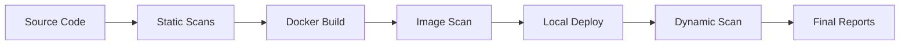

# DevSecOps Pipeline: Full Architecture & Orchestration
**Step 9 Implementation**

## 1. Pipeline Overview
The SecureShop DevSecOps Pipeline is a fully automated security workflow that integrates static and dynamic testing into the software development lifecycle. It follows a "Fail-Fast" principle to identify vulnerabilities before they reach production.

## 2. Orchestration Workflow
The pipeline is orchestrated by `run_pipeline.ps1`, which coordinates the following phases:

### Phase 1: Static Analysis (Pre-Build)
- **Secrets Scanning**: Detects hard-coded credentials using Gitleaks.
- **SAST**: Analyzes Python/Node.js code for security flaws using Semgrep.
- **SCA**: Identifies vulnerable third-party libraries using Trivy.
- **IaC Scan**: Audits Dockerfiles and Docker Compose files for misconfigurations.

### Phase 2: Build & Image Security
- **Secure Build**: Builds Docker containers using optimized base images.
- **Container Scan**: Scans the final built image for OS-level vulnerabilities.

### Phase 3: Dynamic Analysis (Runtime)
- **Live Deployment**: Orchestrates a local deployment using Docker Compose.
- **DAST**: Conducts automated penetration testing against the running API using OWASP ZAP.

## 3. Architecture Diagram

## 4. Key Security Tools
| Category | Tool |
| :--- | :--- |
| **Secrets** | Gitleaks |
| **SAST** | Semgrep |
| **SCA/IaC/Image** | Trivy |
| **DAST** | OWASP ZAP |

## 5. Conclusion
With the implementation of the Master Orchestrator, the security process is now repeatable, automated, and comprehensive. This architecture ensures that every change is vetted against multiple layers of security defense.
